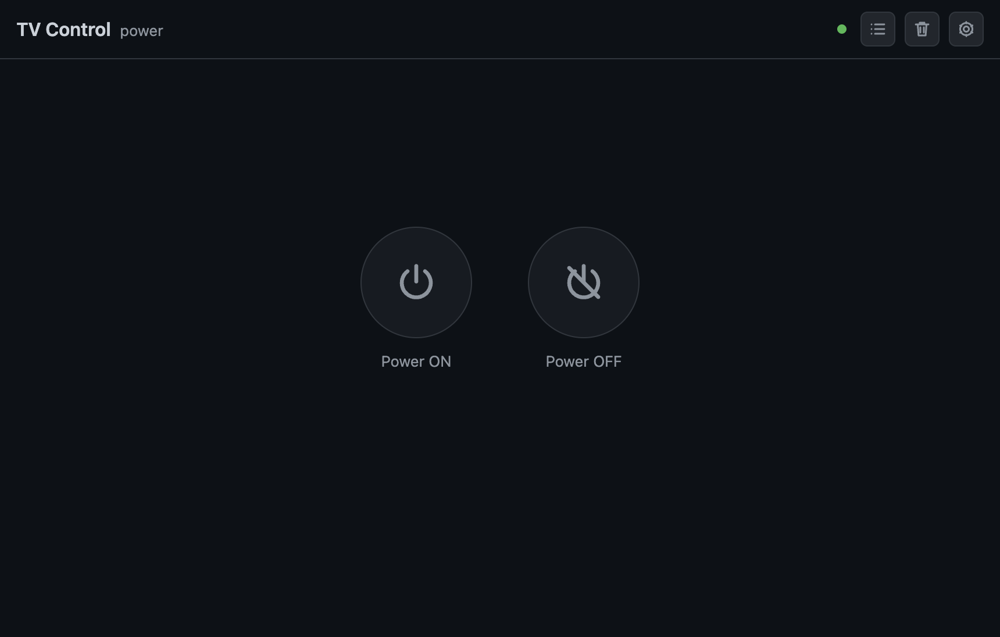
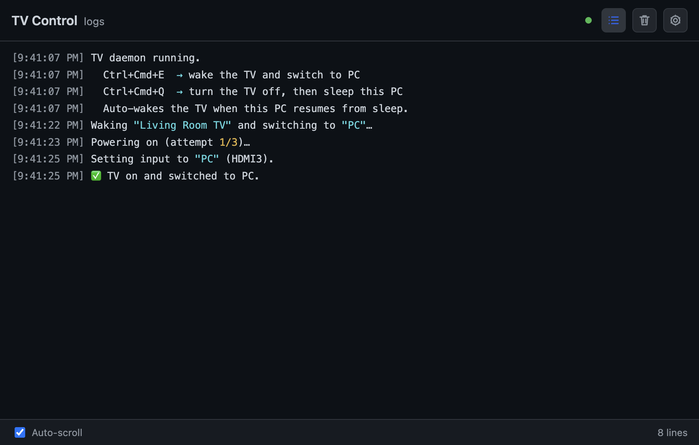

# Samsung TV Control

A small desktop app (and CLI) that wakes your Samsung TV and switches its input to
your PC — from a global hotkey, a tray menu, or a single click — and puts everything
back to sleep when you're done. It controls the TV **directly over your local
network** (Wake-on-LAN + the Samsung remote WebSocket): no account, no cloud, works
offline. Optionally, you can also sign in to **SmartThings** and control the TVs on
your Samsung account through the cloud, side by side with the local ones.



## Why this app exists

If you use a Samsung TV as a monitor, the daily ritual is tedious: turn the TV on,
grab the remote, cycle to the right HDMI input, and reverse all of it when you walk
away. This app collapses that into a one-gesture flow:

- **Sitting down at the PC?** One hotkey wakes the TV and switches it to your PC input.
- **Done for the day?** One hotkey turns the TV off and sleeps the PC.
- **PC woke from sleep?** The TV comes back on and switches to PC automatically.

It runs quietly in the system tray so those hotkeys work any time after boot.

## Main features

- **Local (LAN) control** — pair once with the TV's on-screen "Allow" prompt; after
  that the app powers it on with Wake-on-LAN and drives it over the Samsung remote
  WebSocket. No Samsung account needed, and it keeps working when your internet is down.
- **LAN discovery** — find the TV on your network from Settings instead of typing an IP.
- **Power screen** — three big buttons: *Power ON* (wake TV → switch to PC),
  *TV OFF* (TV off, this PC stays on), and *TV OFF + Sleep PC* (TV off → sleep this PC).
- **Global hotkeys** — fire the wake and off+sleep actions from anywhere, no window
  focus needed.
  Defaults: **Cmd + Ctrl + E** / **Cmd + Ctrl + Q** on macOS, **Ctrl + Alt + E** /
  **Ctrl + Alt + Q** on Windows/Linux. Both are rebindable in Settings.
- **Auto-wake on resume** — when the PC wakes from sleep, the TV turns back on and
  switches to PC automatically. Works on every platform, no extra setup.
- **Runs in the tray** — closing the window hides it to the tray; the daemon keeps
  running. The tray menu exposes both actions and Settings.
- **Live log window** — watch every command stream in, with syntax-highlighted
  timestamps, device names, and results.
- **Multi-TV aware** — pair several TVs, pick which ones commands target, and give
  each its own input override, alias, or dedicated hotkeys.
- **Cloud control (experimental)** — sign in to SmartThings from Settings and the TVs
  on your Samsung account appear alongside the local ones (marked with a "Cloud"
  badge). The cloud can read the current input and power state precisely, which the
  local protocol can't.
- **Light / dark / system theme** — dark by default (shown above).
- **Mock mode** — a built-in fake TV/cloud lets you run and develop the whole app
  without credentials or a real TV.
- **CLI** — the same actions scriptable from a terminal (`npm start`, `npm run devices`, …).



## Before the first launch

For **local control** (the default) you need:

1. **Node 20 or newer** (uses built-in `fetch`) — only for running from source; the
   packaged app bundles its own runtime.

2. **The TV on your network** with network standby enabled ("Power On with Mobile" /
   "Wake on Wireless Network" in the TV's connection settings), so Wake-on-LAN can
   reach it while it's off.

Then launch the app, open **Settings → TV control → + Add a TV**, hit **Discover**
(or type the TV's IP and MAC), click **Pair**, and accept the "Allow" prompt on the
TV screen. Finally set the **PC input** — either a source key sequence recorded in the
TV's own tab, or the shared input name (e.g. `HDMI2`).

### Optional: cloud control via SmartThings (experimental)

If you also want cloud control (precise input/power state, works from outside the
LAN), you additionally need:

- **Your TV added to SmartThings.** Open the **SmartThings mobile app** and make sure
  the TV appears and is controllable there. If it doesn't work in the SmartThings
  app, it won't work here.

- **A way to authenticate.** Pick one:

  - **OAuth (recommended, permanent).** Create a SmartThings *OAuth-In* app in the
    [SmartThings Developer Workspace](https://developer.smartthings.com/) (or via the
    SmartThings CLI) to get a **Client ID** and **Client Secret**. Paste them into
    **Settings → Experimental → OAuth client** and click **Sign in with SmartThings**.
    Tokens are stored and auto-refresh, so an unattended startup launch keeps working
    across reboots.

    > A refresh token expires only after 30 days of non-use; normal daily use keeps it alive.

  - **Personal Access Token (quick test only).** Generate one at
    <https://account.smartthings.com/tokens> with the *Devices* scopes (list, see
    status, execute commands) and set `SMARTTHINGS_TOKEN` in your environment.
    ⚠️ **PATs created after Dec 30, 2024 expire after 24 hours**, so this is fine for a
    one-off test but not for a permanent setup — use OAuth for that.

## Getting started — development

```sh
git clone https://github.com/timdevlet/samsung-tv-control.git
cd samsung-tv-control
npm install
```

Run the desktop app in dev mode (tray + log window, renderer hot-reloads on edit):

```sh
npm run electron:dev        # build main/preload, start Vite, launch Electron
```

**No TV handy?** Run in **mock mode** — a stateful in-process fake of the TV (and the
SmartThings cloud), so the whole app works with no hardware and no credentials:

```sh
npm run electron:dev:mock   # same app, TV + cloud are simulated
```

Other useful scripts:

```sh
npm test                    # run the Vitest suite (uses the mocked cloud)
npm run typecheck           # type-check main + renderer
npm start                   # CLI: wake TV → switch to PC, then exit
npm start -- --hdmi 3       # CLI: switch to HDMI 3 this run
npm run login               # CLI: one-time SmartThings OAuth bootstrap (cloud only)
npm run devices             # CLI: list configured/account devices + capabilities
npm run reset               # forget paired TVs / stored tokens
```

### Project layout

| Path | What lives there |
| --- | --- |
| `src/api/` | LAN transport (WoL + remote WebSocket), SSDP discovery, SmartThings REST client + OAuth |
| `src/domain/` | Pure logic (config, TV selection, hotkeys, CLI parsing) — unit-tested |
| `src/daemon-core.ts` | The background daemon: hotkeys, auto-wake, boot reconcile |
| `src/electron/` | Electron main, preload, and the React renderer (`renderer/`) |
| `src/dev/` | Mock TV/cloud + fixtures for `SMARTTHINGS_MOCK=1` |
| `tests/` | Vitest suite |

## Deployment — building distributables

The app has **no native modules** (global hotkeys use Electron's built-in
`globalShortcut`), so there's nothing to rebuild and no cross-compile caveat — build on
the target OS (or its CI).

```sh
npm run dist:win   # Windows: NSIS installer + portable .exe   → release/
npm run dist:dir   # Unpacked build for quick local testing     → release/
npm run dist       # Default target for the current platform (dmg on macOS, AppImage on Linux)
```

`npm run dist:win` produces, in `release/`:

- **`Samsung TV Control Setup <version>.exe`** — NSIS installer (Start-menu / desktop
  shortcuts; install dir is chooseable).
- **`Samsung TV Control <version>.exe`** — single-file **portable** exe (no install).

### Where the packaged app keeps its config

The CLI reads `smartthings-config.json` from the repo root, but a packaged app's files
are inside a read-only archive, so the desktop app reads/writes elsewhere:

- **Portable exe:** `smartthings-config.json` next to the `.exe`.
- **Installer:** `%APPDATA%\Samsung TV Control\smartthings-config.json`.

Override the location with `SMARTTHINGS_CONFIG_PATH`. The file holds the paired TVs
(host/MAC/pairing token), your preferences, and — if you signed in — the SmartThings
OAuth tokens.

### Run on startup

Launch the app at login so the hotkeys and auto-wake are always available. On Windows,
drop a shortcut to `Samsung TV Control.exe` into the Startup folder (**Win + R** →
`shell:startup`), or create a **Task Scheduler** task triggered *At log on*. If you use
the cloud, sign in with **OAuth, not a PAT** — a 24h PAT would break the next day.

## Troubleshooting

- **Pairing fails / times out.** The TV must be ON to show the "Allow" prompt — turn it
  on, click Pair again, and accept the prompt within 30 seconds. If it was denied once,
  remove the app under the TV's *Settings → General → External Device Manager → Device
  Connect Manager* and re-pair.
- **Wake-on-LAN doesn't turn the TV on.** Check the MAC address in Settings and enable
  the TV's network-standby option ("Power On with Mobile" / "Wake on Wireless
  Network"). Waking from deep standby over Wi-Fi is best-effort on some models —
  Ethernet is more reliable.
- **Discovery finds nothing.** Some networks block SSDP multicast — enter the TV's IP
  (and MAC) manually; discovery is only a convenience.
- **Input won't change (local).** The local protocol has no absolute "set HDMI2"
  command, so the app sends source keys. If the single key doesn't land on your PC
  input, record the exact key sequence in the TV's tab (e.g. `KEY_HDMI,KEY_HDMI`).
  When the TV is already on, the app deliberately leaves the input alone — it can't
  read the current input over the LAN, and blind key presses could switch away from it.
- **401 / token rejected (cloud).** The token is invalid or expired. Re-sign in (OAuth)
  or regenerate and re-export `SMARTTHINGS_TOKEN` (PAT).
- **Cloud TV not found.** Run `npm run devices` to see what your account exposes; the
  app treats a device with an input-source capability (`samsungvd.mediaInputSource` or
  `mediaInputSource`) as a TV. Verify it powers on from the SmartThings app itself.
- **Hotkey does nothing.** The combo may be claimed by the OS or another app —
  registration then fails and the log notes it. Pick a different combo in Settings.

## How it works

Cloud and local TVs run side by side; every command is routed per device — a
`local:<mac>` id goes over the LAN, a SmartThings UUID goes to the cloud.

**Local (LAN):**

- *Power on* — a Wake-on-LAN "magic packet" (UDP broadcast) built from the TV's MAC.
- *Everything else* — the Tizen remote WebSocket at `wss://<tv>:8002/api/v2/channels/samsung.remote.control`:
  remote-key "Click" frames (`KEY_POWER` to power off, source keys or a recorded
  sequence to switch input). The first connection pops the TV's "Allow" prompt and
  returns a token the app stores; power state is probed via the TV's info endpoint
  (`http://<tv>:8001/api/v2/`).
- *Discovery* — an SSDP `M-SEARCH` multicast; responders that look like Samsung TVs
  pre-fill the host/MAC fields in Settings.

**Cloud (SmartThings REST, `https://api.smartthings.com/v1`):**

- `GET /devices` — find the TVs (devices with an input-source capability).
- `GET /devices/{id}/status` — read power state, current input, and supported inputs.
- `POST /devices/{id}/commands` — `switch.on` / `switch.off` and `setInputSource("HDMI3")`.

The daemon core registers the global hotkeys, detects resume-from-sleep with a heartbeat
timer, and drives the TV; the window only mirrors the log stream and offers the actions
as buttons.

## License

[MIT](LICENSE)
